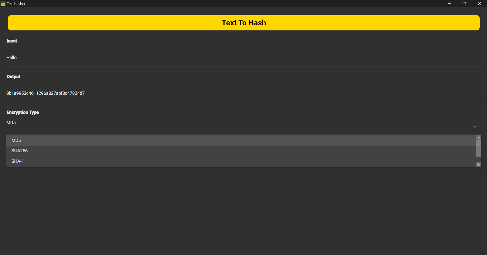

# Text To Hash

A simple C# Avalonia UI application that converts text into various cryptographic hashes. This project demonstrates hashing algorithms like MD5, SHA-1, SHA-256, and SHA-3 with an easy-to-use interface.

## Features

- **Multiple Hash Algorithms**  
  Convert any input text to hashes using MD5, SHA-1, SHA-256, and SHA-3 algorithms real-time.

- **Easy Copy and Paste**  
  Quickly copy the resulting hash to your clipboard for use in your projects or security checks.

## TODO

- **More Hashing Algorithms**  
  Add additional hash functions such as SHA-512, Blake2, Whirlpool, and others.

- **Salting Options**  
  Introduce the ability to add salt to your hashes to increase security and prevent rainbow table attacks.

- **Cipher Implementations**  
  Include simple ciphers like Caesar cipher and more advanced encryption options.

- **Decrypt Options**  
  Implement decrypt features if possible, especially for reversible ciphers, to extend functionality.

- **Enhanced UI Features**  
  Add customization for hash output formatting, saving outputs, and more user preferences.

